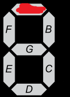

# Final Project - Numberle

This is my final project submission for CPE 487 Digital System Design

With the craze of "le" games going around, I decided I wanted to create a number guessing game for my project. The concept of the game is that a user can input a 3 bit number (0-7) onto the board using the on-board switches and then check their guess with the BTND button. Everytime a new target number wants to be generated, the user can push the BTNU button, causing a new random number to be generated.

## Demonstration of inputting all possible guesses using on-board switches

## Demonstration of attempting to guess correct number and generating new numbers

## Future improvements

Over the summer I plan on making this project follow more of a "le" design. By this I mean I want to be able to instead generate a larger number and display whether each digit is:

1. In the correct position (Represented by a top bar)

2. In the number but in the incorrect position (Represented by a middle bar)

3. Not in the number (Represented by a bottom bar)

